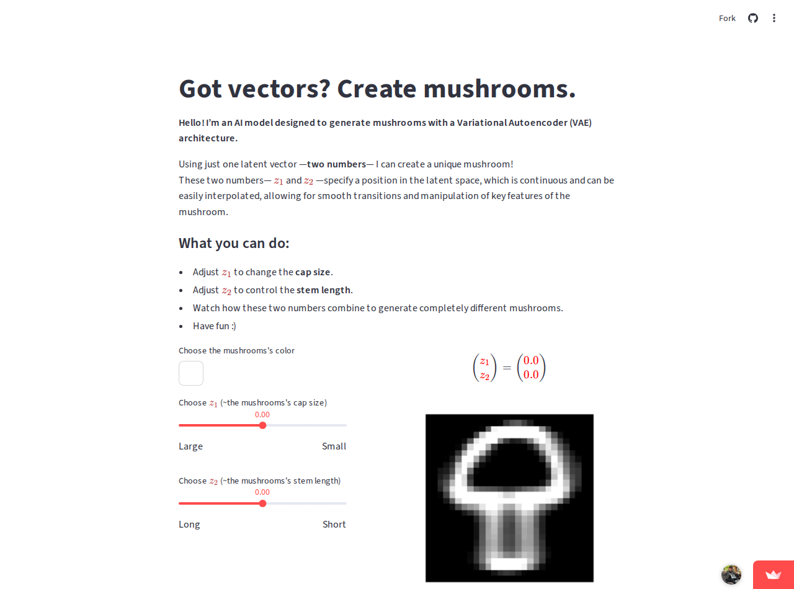
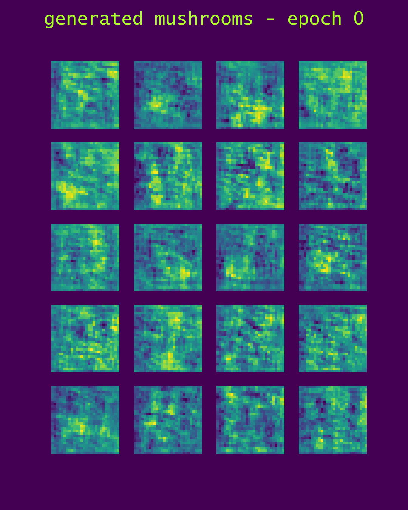

# Mushroom Generator 🍄

**The main product is a tiny, interpretable mushroom VAE — a latent space
small enough to actually understand — and a suite of apps for exploring
it: steer the latent vector, watch every decoder layer work, walk the
space to music.**

**Try it live:** [mushroom-generator.streamlit.app](https://mushroom-generator.streamlit.app) ("Got vectors? Create mushrooms.") · [shroomrier.streamlit.app](https://shroomrier.streamlit.app) (The Shroomifier — recording → Fourier → latent space → mushroom)





- **Generate mushrooms** — the VAE turns latent vectors into mushroom
  sketches.
- **Explore latent space** — modify the latent vector and watch how the
  mushrooms change; the relationship between latent space and image is the
  whole point.
- **Visualize decoder layers** — the intermediate steps of the decoder,
  from reshaping the latent vector to progressively refining the image.

## The latent-space apps

```bash
pip install -r requirements.txt
streamlit run app_generate_mushroom.py     # generate & steer, decoder layers exposed
streamlit run app_latent_mycelium.py       # latent-space explorer
streamlit run app_music_to_mushroom.py     # latent walk driven by music
```

Model-developer apps: `app_train_model_VAE.py` (the VAE actually used) and
`app_train_model_GAN.py` (the earlier GAN attempt).

## Why a VAE, honestly

Initially this was a Generative Adversarial Network — but the latent space
it produced wasn't interpretable, which made exploring and manipulating the
images meaningless. The VAE gives a continuous, interpretable latent space,
so the GAN stays only as history (`src/gan_model.py`, the gif above).

And why mushrooms: various QuickDraw sketch classes were tried (cakes,
cars, dragons, moons, faces — the `generated_images_*` folders are the
graveyard), but mushrooms proved the best subject: distinct shape, honest
variety.

## Structure

```
app_generate_mushroom.py     # streamlit app for users (you)
app_latent_mycelium.py       # latent-space explorer
app_music_to_mushroom.py     # music → latent walk
app_train_model_VAE.py       # trainer for the VAE actually used
app_train_model_GAN.py       # trainer for the abandoned GAN
src/                         # vae_model.py, gan_model.py, data prep, utils
streamlit_frontend/          # dataviz pieces for the apps
trained_*VAE_mushroom*.h5    # the shipped trained encoder/decoder
```

Resources: [VAE with convolution on MNIST](https://www.kaggle.com/code/vincentman0403/vae-with-convolution-on-mnist)
